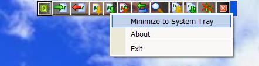



## KazIE 2\.1\.0\.1

### Description

NEW VERSION!!!! OPTIMIZED FOR WINDOWS XP!!!

If you use Kazaa Lite, sometimes you may want to kill all uploaders or pause downloads, or disconnect, etc. This little program allows you to do just that: performs many operations with Kazaa Lite. You can download Kazaa Lite from www.k-lite.tk.

PLEASE VOTE FOR ME AND E-MAIL ME IF YOU HAVE ANYTHING YOU HAVE ADDED OR WOULD LIKE ME TO ADD!!!

***NEW UPDATES***:

>New GUI enhancements like fading and Office XP-style menu (screenshot)

>Minimize to system tray w/icon

>Minor fixes

----

VISIT http://jaker.edskes.com FOR UPDATES!!!

**It cannot go unsaid...special thanks to Shantibhushan for the SystemInteroperatavility DLL and Michael Cowell for the systray module!
 
### More Info
 
To move the program around, use the blue bar on the right side (right click there too).

NOTE: THE ptmd5.dll FILE MUST BE COPIED TO YOUR WINDOWS FOLDER IN ORDER FOR PAUSE ALL/RESUME ALL TO WORK!!

             |
---                |---
**Submitted On**   |2003-04-10 20:30:36
**By**             |[Jacob Thornberry](https://github.com/Planet-Source-Code/PSCIndex/blob/master/ByAuthor/jacob-thornberry.md)
**Level**          |Advanced
**User Rating**    |4.7 (14 globes from 3 users)
**Compatibility**  |VB 6\.0
**Category**       |[Complete Applications](https://github.com/Planet-Source-Code/PSCIndex/blob/master/ByCategory/complete-applications__1-27.md)
**World**          |[Visual Basic](https://github.com/Planet-Source-Code/PSCIndex/blob/master/ByWorld/visual-basic.md)
**Archive File**   |[KazIE\_2\_1\_1572154102003\.zip](https://github.com/Planet-Source-Code/jacob-thornberry-kazie-2-1-0-1__1-44450/archive/master.zip)

### API Declarations

This program does not use API's to communicate with Kazaa Lite, but with Modules (which are included).

